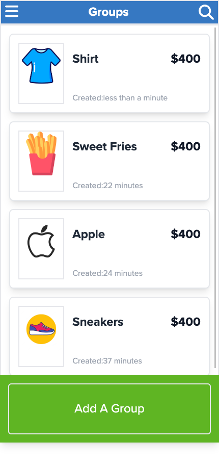

# Fundable

> A mobile web application where you can manage your budget: you have a list of transactions associated with a category, so that you can see how much money you spent and on what.

## Homepage

## Getting Started

This repository includes files with plain SQL that can be used to recreate a database:

- Git clone the repository.
- Run `bundle install`
- Run `rails s`

## Authors

👤 **Muhyideen Elias**
- GitHub: [fourteen98](https://github.com/Fourteen98/)
- Twitter: [muhiydeen](https://twitter.com/muhiydeen)
- Linkedin: [muhyideen-elias](https://www.linkedin.com/in/muhyideen-elias-53719994/)

## 🤝 Contributing

Contributions, issues, and feature requests are welcome!

Feel free to check the [issues page](../../issues/).

## Show your support

Give a ⭐️ if you like this project!

## Acknowledgments

- Microverse

## 📝 License

This project is [MIT](./LICENSE) licensed.
